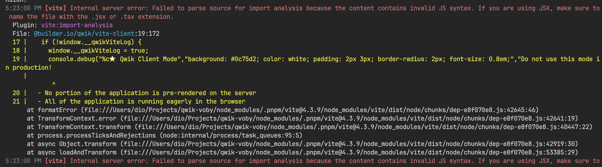

# qwik-voby ⚡️

QwikVoby allows adding [Voby](https://github.com/vobyjs/voby) components into existing Qwik application

> **NOTE**: voby is a focused on the client component, so here we ignore all SSR and hydrate related options.


**WARN: qwik@1.2.4 vite plugin has bug?**


## How to Integrate into a Qwik app

Integration is pretty much the same as <https://qwik.builder.io/docs/integrations/react/>.

First, install `@stackcraft-io/qwik-voby` with npm, pnpm or yarn. Instead of `react` and `react-dom`, you will need to install `voby`. And don't forgot `/** @jsxImportSource voby */`

```sh
pnpm add @stackcraft-io/qwik-voby
```

create `counter.tsx`

```tsx
/** @jsxImportSource voby */
import { qwikify$, observable } from '@qwikdev/qwik-voby';

// Create Voby component standard way
function Counter() {
  const count = observable(0);
  const incr = () => count((i) => i + 1);
  return (
    <button className="voby" onClick={incr}>
      Count: {count}
    </button>
  );
}

// Convert Voby component to Qwik component
export const QCounter = qwikify$(Counter, { eagerness: 'hover' });
```

index.tsx

```tsx
import { component$ } from '@builder.io/qwik';
import { QCounter } from './counter';

export default component$(() => {
  return (
    <main>
      <QCounter />
    </main>
  );
});
```

vite.config.ts

```ts
// vite.config.ts
import { qwikVoby } from '@qwikdev/qwik-voby/vite';

export default defineConfig(() => {
   return {
     ...,
     plugins: [
       ...,
       // The important part
       qwikVoby()
     ],
   };
});
```

Please keep in mind that this is an experimental implementation based on [`qwik-preact`](https://github.com/QwikDev/qwik-preact) implementation. So, there might be bugs and unwanted behaviours.

---

## Related

- [Qwik Docs](https://qwik.builder.io/docs/)
- [Qwik on GitHub](https://github.com/BuilderIO/qwik)
- [@QwikDev](https://twitter.com/QwikDev)
- [Discord](https://qwik.builder.io/chat)
- [Vite](https://vitejs.dev/)
- [Partytown](https://partytown.builder.io/)
- [Mitosis](https://github.com/BuilderIO/mitosis)
- [Builder.io](https://www.builder.io/)
- [qwik-preact](https://github.com/QwikDev/qwik-preact)
